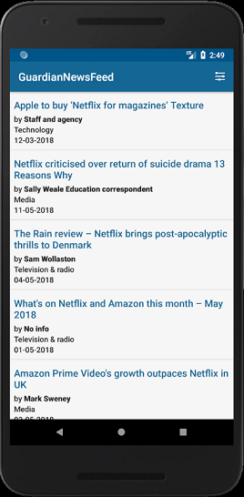
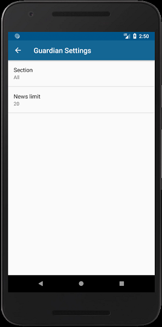
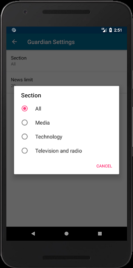

Guardian News Feed
===================================

Application is the Guardian news feed - as news's subject, I chose the netflix platform (for the update I'll let the user choose subject). App connects with the Guardian Newspaper API and sending request for the information. It's downloading news title, author, date and section, which are then listed within the ArrayList. Menu element is added and placed in the top ActionBar through which settings activity can be accessed. In settings activity user can open the Preference Fragment in which the news number displayed can be changed, as well as section of the received information filtered (between technology, media and television). Also, every news listed in the ArrayList is directing to the exact website where user can find more on the subject. For the xml layout files I used the constraintLayout containers. All used images have different densities, used dependently on the device screen size. App is using loaders to connect asynchronously with API.

If you want to see the app in action, please follow this link: https://tr0lczyk.tinytake.com/sf/MjYwNjA1M183ODQxNjk2

The application looks like that:

